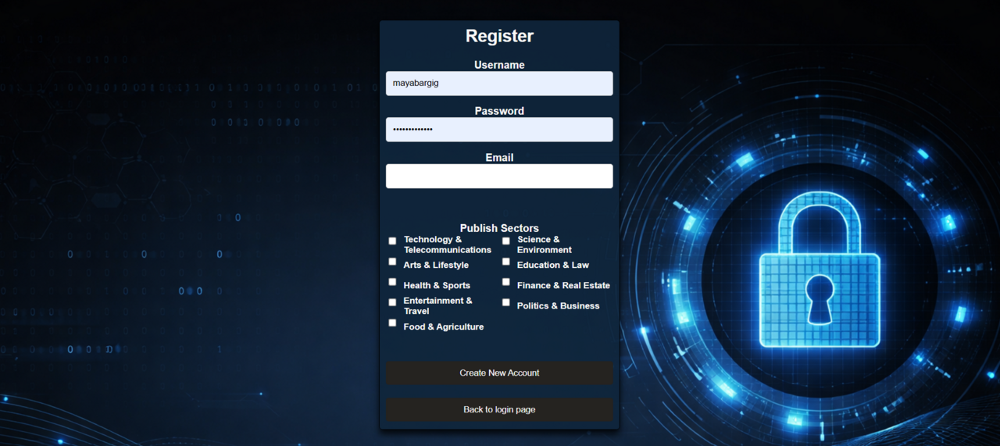
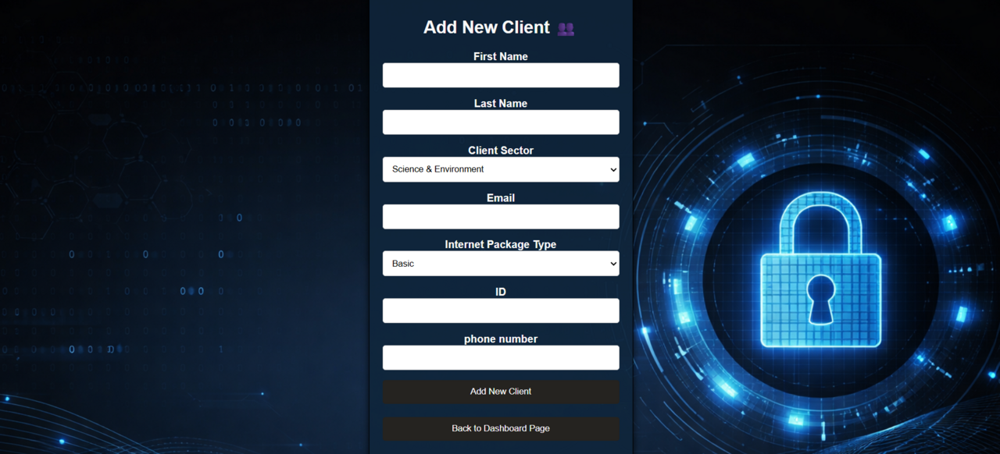
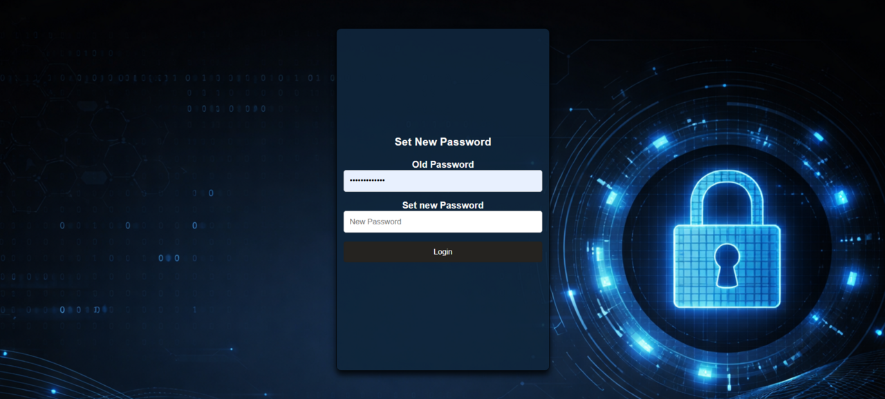
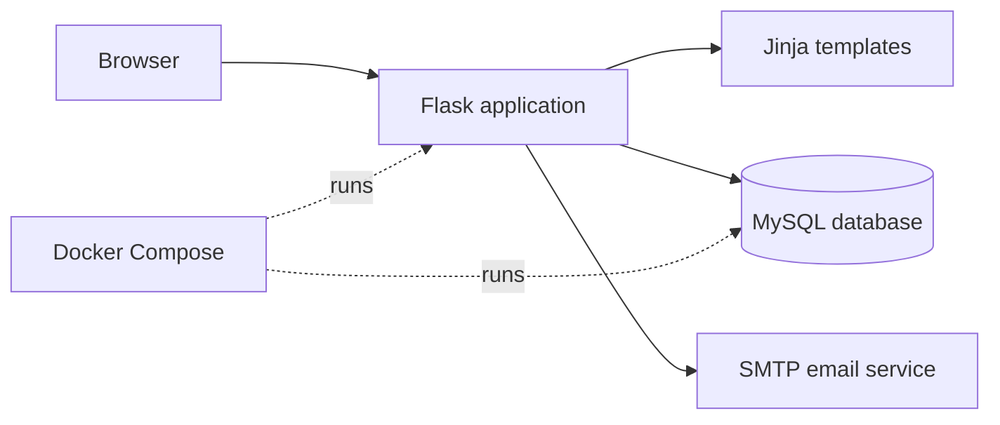
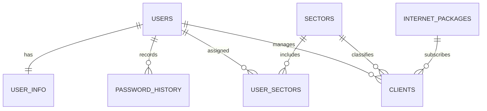

<h1 align="center">Communication LTD Security Lab</h1>

<p align="center">
  A Flask and MySQL customer-management portal built to demonstrate secure web-development practices by comparing a hardened implementation with an intentionally vulnerable version.
</p>

<p align="center">
  
  
  
  
  
</p>

---

## About the project

Communication LTD is an academic computer-security project presented as a fictional internet-service provider. Employees can register, sign in, manage customer records, search for customers and maintain their passwords.

The repository contains two deliberately different implementations of the same application:

| Branch | Purpose |
|---|---|
| [`main`](https://github.com/mayabargig/computer_security_project/tree/main) | Hardened version using parameterized queries and password hashing |
| [`vulnerable`](https://github.com/mayabargig/computer_security_project/tree/vulnerable) | Intentionally insecure version for demonstrating SQL injection and unsafe password handling |

> This project is intended for local education and controlled security demonstrations. The vulnerable branch must never be exposed to the public internet or used with real data.

## Application features

- Employee registration and session-based authentication
- Configurable password-complexity policy
- Detection of common passwords using a local denylist
- Password hashing with PBKDF2-HMAC-SHA256 and per-user salts on `main`
- Temporary IP blocking after repeated failed login attempts
- Password changes and password-history records
- Password-reset flow with email support and a development fallback
- Customer creation and exact-name search
- Employee-to-sector assignments
- Dockerized Flask application and MySQL database
- Automatically initialized relational database schema and reference data

## Screenshots

<table>
  <tr>
    <td align="center" width="50%">
      <br />
      <sub><b>Employee login</b></sub>
    </td>
    <td align="center" width="50%">
      <br />
      <sub><b>Account registration</b></sub>
    </td>
  </tr>
  <tr>
    <td align="center" width="50%">
      <br />
      <sub><b>Customer dashboard</b></sub>
    </td>
    <td align="center" width="50%">
      <br />
      <sub><b>Add a customer</b></sub>
    </td>
  </tr>
  <tr>
    <td align="center" width="50%">
      <br />
      <sub><b>Password recovery</b></sub>
    </td>
    <td align="center" width="50%">
      <br />
      <sub><b>Login protection</b></sub>
    </td>
  </tr>
</table>

## Secure and vulnerable implementations

The two branches make it possible to inspect how small implementation decisions affect application security.

| Security area | `main` branch | `vulnerable` branch |
|---|---|---|
| SQL queries | Parameterized queries with placeholders | User input interpolated directly into SQL strings |
| Password storage | PBKDF2-HMAC-SHA256 hash with a unique random salt | Plaintext password storage and comparison |
| Authentication | Hashes the supplied password before comparison | Compares the supplied password directly |
| Customer search | First and last name passed as query parameters | Names concatenated into the SQL statement |
| Intended use | Defensive implementation and review | Local attack demonstration only |

### Example: preventing SQL injection

The hardened branch keeps the SQL statement separate from untrusted input:

```python
cursor.execute(
    "SELECT * FROM clients WHERE first_name = %s AND last_name = %s",
    (first_name, last_name),
)
```

The database driver binds and escapes the values instead of treating them as executable SQL syntax.

### Password protection

Passwords in the hardened branch are processed with:

- A cryptographically random salt for every password
- PBKDF2-HMAC-SHA256
- 100,000 iterations
- A configurable complexity policy
- A common-password denylist
- Password-history records

## System architecture



## Database model



The schema contains:

- `users` — employee credentials and password-reset token
- `user_info` — password salt associated with each employee
- `password_history` — previous password hashes and salts
- `sectors` — supported customer sectors
- `user_sectors` — employee-to-sector assignments
- `clients` — customer and subscription information
- `internet_packages` — available internet packages

## Technology stack

| Layer | Technology |
|---|---|
| Backend | Python and Flask |
| Templates | Jinja2 |
| Frontend | HTML and CSS |
| Database | MySQL |
| Email | Flask-Mail and SMTP |
| Configuration | python-dotenv |
| Containers | Docker and Docker Compose |

## Project structure

```text
computer_security_project/
├── backend.py                 # Flask routes and request handling
├── common_functions.py        # Database and security operations
├── app_configuration.py       # Flask, email and password-policy settings
├── password_config.json       # Configurable password requirements
├── passwords.txt              # Common-password denylist
├── templates/                 # Jinja2 HTML templates
├── static/                    # CSS and background assets
├── database/
│   ├── Dockerfile
│   └── initialization.sql     # Schema and seed data
├── Dockerfile                 # Flask application image
├── docker-compose.yml         # Application and database services
└── .env.example               # Safe configuration template
```

## Getting started

### Prerequisites

- [Git](https://git-scm.com/)
- [Docker Desktop](https://www.docker.com/products/docker-desktop/)

### 1. Clone the repository

```bash
git clone https://github.com/mayabargig/computer_security_project.git
cd computer_security_project
```

### 2. Create the environment file

Copy the provided template:

```bash
cp .env.example .env
```

On Windows PowerShell:

```powershell
Copy-Item .env.example .env
```

Open `.env` and replace the placeholder database password. SMTP settings are optional for local development; when placeholder mail credentials are used, the password-reset token is printed to the application console.

### 3. Start the application

```bash
docker compose up --build
```

Then open:

```text
http://localhost:5000
```

To stop the containers:

```bash
docker compose down
```

## Switching between branches

Run the hardened implementation:

```bash
git switch main
docker compose up --build
```

Run the intentionally vulnerable implementation:

```bash
git switch vulnerable
docker compose up --build
```

Always stop the current containers before switching branches:

```bash
docker compose down
```

## Security scope and limitations

The `main` branch improves the intentionally vulnerable implementation, but it should still be treated as an academic prototype—not as a production-ready security product. Additional production hardening would include:

- CSRF protection for state-changing forms
- Secure, HTTP-only and SameSite session-cookie settings
- A dedicated non-root database user with least privilege
- Persistent, distributed rate limiting instead of in-memory dictionaries
- Expiring, single-use password-reset tokens generated with `secrets`
- Generic password-reset responses to reduce account enumeration
- HTTPS, secret management and production WSGI deployment
- Automated security and integration tests

## Responsible use

Only test the vulnerable branch on systems you own or are explicitly authorized to assess. Do not use real personal information, passwords or customer data in this project.

## Maintainer

Maintained by [Maya Bargig](https://github.com/mayabargig).
